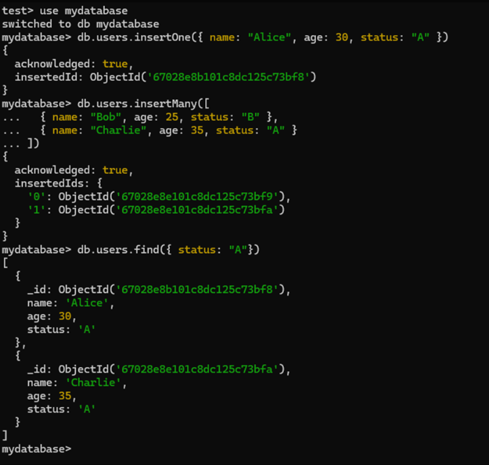
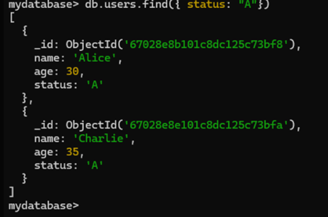
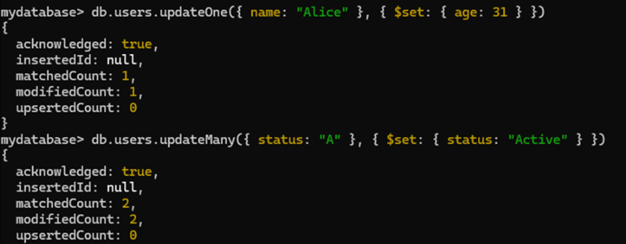
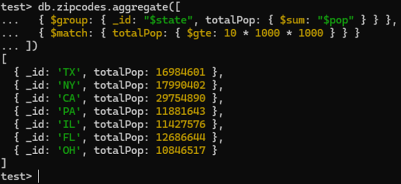
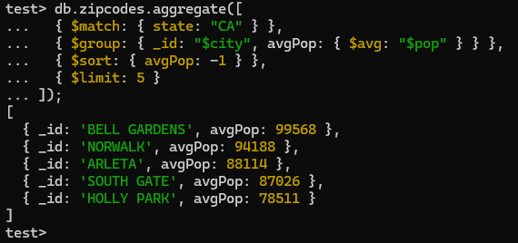

DAT250: Software Technology Experiment Assignment 5
1. Introduction
   In this assignment, I explored MongoDB to understand its core functionalities, including installation, CRUD operations, and aggregation pipelines. The goal was to gain hands-on experience with MongoDB and compare its aggregation framework to SQL queries.

2. Technical Problems Encountered
   Installation Issues
   During the installation of MongoDB, I needed to verify the integrity of the installation package. I used the PowerShell commands to verify the SHA-256 checksum of the downloaded MongoDB installer against the official hash file.

Screenshot: Verification of Installation Package

This ensured the integrity of the package before installation. I also manually started the mongod service as MongoDB was not configured to run as a Windows service by default.

3. Experiment 1: MongoDB CRUD Operations
   Create (Insert) Operation
   I inserted documents into the users collection using insertOne() and insertMany() commands to add one or more documents at a time.

db.users.insertOne({ name: "Alice", age: 30, status: "A" });
db.users.insertMany([
{ name: "Bob", age: 25, status: "B" },
{ name: "Charlie", age: 35, status: "A" }
]);
Screenshot: Insert Operation

The insertOne() command added a single document to the collection, while the insertMany() command added two more documents. The commands returned acknowledgment with the respective insertedId(s).

Read (Query) Operation
I queried the users collection to retrieve all users with a status of "A". The find() method was used to filter the documents.

db.users.find({ status: "A" });
Screenshot: Query Operation

The query returned two documents with the status "A": Alice and Charlie.

Update Operation
To demonstrate the update operation, I updated Alice's age to 31 and modified all users with a status of "A" to have a new status, "Active".

db.users.updateOne({ name: "Alice" }, { $set: { age: 31 } });
db.users.updateMany({ status: "A" }, { $set: { status: "Active" } });
Screenshot: Update Operation

The updateOne() method updated Alice's age, while updateMany() modified the status field for multiple documents.

Delete Operation
I deleted one document from the users collection where the name was "Bob", and attempted to delete all documents with a status of "B", but no documents were removed in this case.

db.users.deleteOne({ name: "Bob" });
db.users.deleteMany({ status: "B" });
Screenshot: Delete Operation

The deleteOne() method successfully removed Bob’s document, while deleteMany() did not find any documents with the status "B" to delete.

4. Experiment 2: Aggregation
   a. Zip Code Example
   I followed the provided example to group documents by state and calculate the total population for each state, then filtered the results to only include states with a population greater than or equal to 10 million.

db.zipcodes.aggregate([
{ $group: { _id: "$state", totalPop: { $sum: "$pop" } } },
{ $match: { totalPop: { $gte: 10 * 1000 * 1000 } } }
]);
Screenshot: Zip Code Aggregation

This query provided a list of states such as Texas, New York, and California, with total populations above 10 million.

b. Custom Aggregation Operation
Screenshot:

For my custom aggregation, I wrote a pipeline to find the top 5 cities with the highest average population in California. This operation can be useful for city planning or resource allocation.

db.zipcodes.aggregate([
{ $match: { state: "CA" } },
{ $group: { _id: "$city", avgPop: { $avg: "$pop" } } },
{ $sort: { avgPop: -1 } },
{ $limit: 5 }
]);

This aggregation filters documents by state, groups them by city, calculates the average population for each city, and returns the top 5 cities by average population.

5.Reflection on Map-Reduce Aggregation vs. SQL

Similarities 

Both MongoDB’s aggregation pipeline and SQL queries provide tools for data filtering, grouping, and aggregation (e.g., sum, average). The logic behind operations like grouping by fields and filtering results is similar in both cases.

Differences

MongoDB’s aggregation pipeline is more imperative, with each stage building on the result of the previous one. SQL, on the other hand, is declarative and tends to be more user-friendly for those familiar with traditional relational databases. MongoDB’s approach aligns better with distributed systems, particularly with sharding and partitioning in mind.

Efficiency

MongoDB’s aggregation pipeline, especially in sharded environments, offers potential performance benefits over SQL when dealing with distributed datasets. In terms of user-friendliness, SQL might be easier to pick up for those with prior experience in relational databases.

6.Pending Issues

   Due to time constraints, I could not implement a more complex geospatial aggregation operation. In the future, I plan to explore geospatial queries in MongoDB and work on more advanced data analysis tasks.

7.Conclusion

   This assignment provided valuable insight into MongoDB, particularly the differences between NoSQL and SQL-based databases. I gained hands-on experience with MongoDB’s CRUD operations and learned how to perform complex data transformations using its aggregation pipeline. Additionally, I was able to compare MongoDB’s aggregation to traditional SQL queries, noting key differences in abstraction and efficiency.